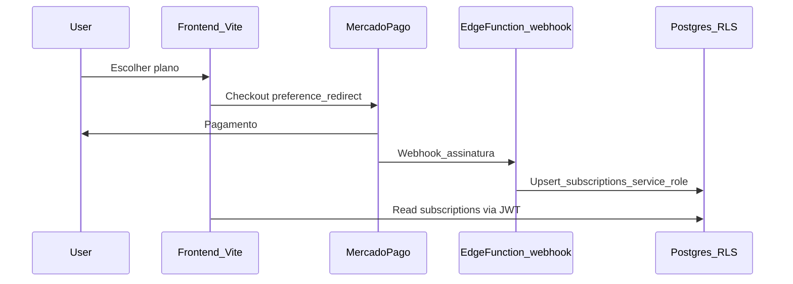

# Integração futura — Mercado Pago (desenho técnico)

Este documento **não** implementa pagamentos. Define alinhamento para quando o gateway for ligado.

## Estado actual

- Tabela `subscriptions` com `agency_id`, `plan`, `status`, `max_clients`, `max_alerts`, `current_period_end`.
- Limites aplicados na UI via [`useSubscriptionLimits`](src/hooks/use-subscription-limits.tsx) e [`mergeSubscription`](src/lib/subscription-limits.ts).
- Ajuste manual/demo na área Admin (`subscriptions` upsert) — **não** é modelo de produção.

## Objectivos da integração MP

1. **Pagamentos recorrentes** ou por período alinhados aos planos (free/trial/pro/etc.).
2. **Fonte de verdade** para `subscriptions`: atualizada por **webhooks** assinados + Edge Function com **service role**, não pelo browser.
3. **Sem permissão** para `authenticated` alterar `subscriptions` diretamente via PostgREST (RLS: SELECT para owner/admin; INSERT/UPDATE apenas via service role ou políticas explícitas com checks).

## Componentes sugeridos

## Esquema de dados (extensões típicas)

Colunas ou tabela auxiliar (decidir na implementação):

- `subscriptions.mp_customer_id` / `mp_subscription_id` (texto, índice único por agency onde aplicável).
- `subscription_events` ou uso da tabela existente `activities` para auditoria de mudanças de plano (opcional).
- Timestamp `billing_updated_at` para reconciliação.

## Edge Functions

| Função | Responsabilidade |
|--------|------------------|
| `mercadopago-webhook` (nova) | Validar assinatura HMAC/cabeçalhos MP; idempotência por `event.id`; actualizar `subscriptions`; responder 200 rápido. |
| `create-checkout-session` (nova) | JWT obrigatório; criar preferência MP; devolver URL ou `init_point`; **nunca** confiar no cliente para plano sem validação servidor. |

Secrets Dashboard:

- `MERCADOPAGO_ACCESS_TOKEN` (produção vs sandbox).
- `MERCADOPAGO_WEBHOOK_SECRET` (se aplicável ao modelo MP).

## RLS

- Rever políticas actuais em `subscriptions` (owner/admin SELECT; UPDATE restrito).
- **Remover** qualquer caminho em que membro autenticado faça `UPDATE subscriptions` exceto fluxos administrativos explícitos via função com validação.
- Webhook usa **service role** → bypass RLS; validação de negócio dentro da função (`agency_id` deve corresponder ao metadata guardado no checkout).

## Frontend

- Página **Planos & facturação**: estado actual do plano, datas, CTA “Gerir subscrição” / “Upgrade”.
- Após MP: redirect URLs de sucesso/cancelamento configuradas no MP e nas env (`PUBLIC_SITE_URL`).

## Testes

- Webhook: payloads de teste MP + idempotência duplicada.
- E2E smoke: utilizador vê limites correctos após simulação de webhook em staging.

## Ordem de implementação recomendada

1. Endurecer RLS em `subscriptions` e remover upsert demo da UI em produção (substituir por flags/feature).
2. Função checkout + webhook + colunas MP.
3. UI planos e mensagens de limite alinhadas ao estado real.
